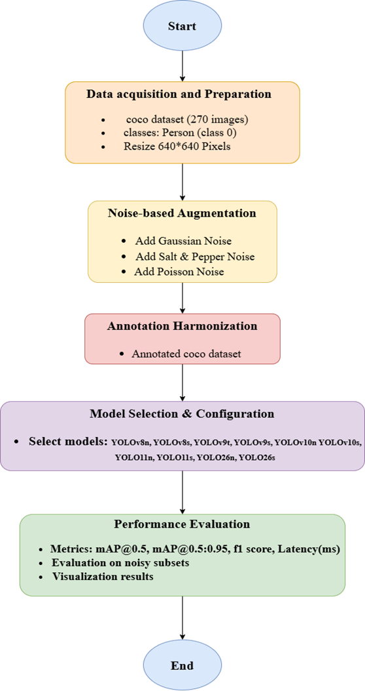

# Analyzing the Evolution of YOLO Models with Robustness Assessment under Standard Noise Conditions

  
  
  
  
  

Note: For full report of study check out [here](https://drive.google.com/file/d/1J1vXp0BMZrFGeHh08riBXSP8he7sfVDo/view?usp=drive_link).

A systematic benchmarking study evaluating how modern YOLO object detection models hold up when visual quality is degraded — with a focus on lightweight models designed for resource-constrained devices.

As object detection systems are increasingly deployed in real-world environments — including edge devices, embedded systems, and low-power hardware — understanding how well these models perform under imperfect visual conditions becomes critical.

This study benchmarks and compares the robustness of key YOLO model versions, focusing specifically on **small** and **nano** variants that are designed for devices with limited computational resources. The versions covered are:

| Model Version | Focus |
|---|---|
| YOLOv8s | Baseline for comparison |
| YOLOv9c | Programmable gradient information |
| YOLOv10s | NMS-free dual-assignment training |
| YOLOv11s | Architectural efficiency improvements |
| YOLOv26s | Latest generational advancements |

The central research question is: **as YOLO models have evolved with better feature extraction and spatial modeling, has their ability to handle degraded visual input also improved?**

---

## Objectives

- Systematically compare how different YOLO versions respond to progressively worsening image quality
- Identify which architectural improvements contribute to robustness, not just accuracy on clean images
- Provide practical guidance on model selection for deployment in noisy or low-quality imaging environments
- Focus on small and nano model variants to reflect realistic constraints of edge and embedded devices

---

## Noise Conditions Tested

Three types of noise are applied at progressively increasing severity levels to simulate real-world imaging degradation:

### 1. Gaussian Noise
Simulates **thermal and electronic sensor variations** that arise from the physics of image capture. This is a common source of noise in standard cameras, particularly at higher ISO settings or in warm operating conditions.

### 2. Salt-and-Pepper Noise
Models **impulse disturbances and data transmission errors** frequently seen in edge-device communication pipelines. Manifests as randomly scattered bright and dark pixels that corrupt localized regions of an image.

### 3. Poisson Noise
Represents **signal-dependent variations in low-light environments**, where the number of photons captured per pixel follows a statistical distribution. This is especially relevant for night-time or indoor where illumination is limited.

Each noise type is applied across multiple severity levels to produce a degradation curve, allowing the study to measure at what point each model's detection performance begins to break down.

---

## Methodology

---

## Key Research Questions

- Which YOLO version is the most robust to each type of noise?
- Does a model that performs best on clean images also perform best under noisy conditions?
- How do architectural changes across versions affect robustness specifically ?
- Are newer models meaningfully more robust, or does performance under noise remain similar across versions?

---

## Significance

This study is particularly relevant for deployment scenarios such as:

- **Surveillance systems** operating in low-light or harsh lighting conditions
- **Industrial inspection** equipment where sensor noise is common
- **Autonomous systems on embedded hardware** with strict power and compute budgets
- **Remote sensing or communication-constrained pipelines** prone to transmission artifacts

By focusing on robustness rather than just accuracy, this work addresses a gap in standard YOLO benchmarks, which typically evaluate models only on clean, high-quality images.

---

## Requirements
- Python 3.8+
- PyTorch
- Ultralytics (for YOLO models)
- NumPy, OpenCV, Matplotlib

## Results

Results and analysis will be documented in the `results/` directory upon completion of experiments. Summary figures and comparison tables will also be included.